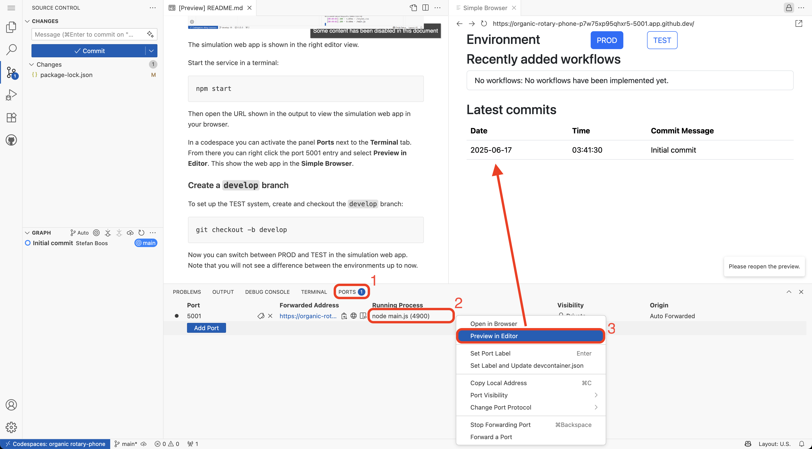

# Git revert workshop

Git revert workshop for continuous integration and branching experiments.

In this workshop you will learn to revert merge commits on a branch, which is
used for integration testing. The article (1) shown in the section Literature
below describes in detail how teams can resolve conflicts in the integration
phase of concurrent development. This workshop addresses the step

> If it doesn’t pass, revert (undo) your check-in.
>
> -- James Shore (1)

## Run the workshop

You can run this workshop as a team or individually.

The workshop provides a small web application to visualize the development
status. If you want to run the workshop in a GitHub codespace, you are ready.
If you are using your local comupter, then you need a recent Node.js version to
run the web app.

### Team setup: Create workshop repository

If you are working as a team, then click the green **Use this template** in the
top right and **Create a new repository**.

Go to the **Settings** of the new repository and select **Collaborators** from
the menu. Invite your team members.

From the shared repository, every team member uses the green **Code** button
in the top right to

- either clone the shared repository to their computer
- or to start the repository in an individual GitHub codespace.

Make sure that you push all local changes to the remote, so that your team
mates can reproduce the workshop steps.

### Single person setup

If you run the workshop alone you can set up your own repository as described
above.

Alternatively, you can directly open the workshop repository as a GitHub
codespace using the green **Use this template** in the top right, followed by
**Open in a codespace**.

In a codespace, there is no need for pushing and pulling. You can work entirely
inside the codespace and delete it afterwards.

## Branching strategy: `main`, `develop`, `feat/xyz`


We simulate a system with a "production" environment (PROD) and an
integration "test" environment (TEST). PROD represents the system used by the
end users. TEST is a copy of PROD. The development teams verify their changes
in the TEST system before they send them to the PROD system.

In our git repository, the PROD system is represented by the `main` branch,
the TEST system is represented by the `develop` branch.

When a developer (team) starts a new feature, they create a branch `feat/xyz`
from `develop`. When the feature is ready for testing, they merge their
feature branch into `develop`. Then the TEST system is updated and the
developers run integration tests.

If all tests pass, the developers merge `develop` into `main`. This causes the
feature to appear in the PROD system.

Finally, they merge `main` back into `develop` to ensure that both branches
are always in sync. They usually delete their feature branch afterwards.

## About the exercises

The exercises simulate how multiple teams develop features concurrently.

Exercise 1 shows the happy path: The feature works out of the box.

Exercise 2 shows the unhappy path: A feature doesn't pass the integration tests
and needs to be fixed. Before we fix the broken feature, we remove it from
the TEST system. This allows other teams to ship their features while we are
debugging.

Exercise 3 shows the unhappy path from the perspective of two teams working
concurrently. Both teams start at the same time. The first team merges a broken
feature into `develop`. They revert that merge commit so that the other team
can ship a working feature. Then the broken feature is fixed and shipped in
addition.

## "The System" and the simulation

In this simulation "The System" is represented by the contents of the
[workflows.txt](./workflows.txt) file on either the `main` branch (PROD) or
on the `develop` branch (TEST). This file describes the features available
in the system.

The simulation provides a small web application to visualize the features
described in [workflows.txt](./workflows.txt). The web app allows switching
between PROD and TEST easily. It also shows the commits, that are considered
by each environment.

## Run the simulation web app

### Prerequisites

Once your working environment is running, restore the node modules:

```shell
npm install
```

### Start the simulation web app



The simulation web app is shown in the right editor view.

Start the simulation in a terminal:

```shell
npm start
```

Then open the URL shown in the output to view the simulation web app in your
browser.

To use the integrated **Simple Browser** in a codespace, activate the panel
**Ports** (1) next to the **Terminal** tab. Right click the **node main.js**
entry (2) and select **Preview in Editor** (3).

### Create a `develop` branch

To set up the TEST system, create and checkout the `develop` branch:

```shell
git checkout -b develop
```

Now you can switch between PROD and TEST in the simulation web app.
Note that you will not see a difference between the environments up to now.

## Visualize the git history in Visual Studio Code

If you are working in Visual Studio Code, you can use the **Graph** panel of
the **Source Control** view to inspect the recent commits. The toolbar of that
panel allows to show "All history item references", i.e. the branches and
other things.

In addition you can install, the
[Git Graph](https://marketplace.visualstudio.com/items?itemName=mhutchie.git-graph)
extension by **mhutchie** to get an excellent overview of the repository history.

Other tools to visualize the git history are:

- [GitExtensions](https://gitextensions.github.io/) for Windows
- [Sourcetree](https://www.sourcetreeapp.com/) for Windows and macOS
- [Fork](https://git-fork.com/) for Windows and macOS

## Exercise 1: Implement and ship a working feature

By "implement a feature" we mean that you add a line to the end of the file
[workflows.txt](./workflows.txt). This will simulate the work required to add
a use case to the system.


1. Create and checkout the feature branch `feat/register` based on the `develop` branch: `git switch develop; git checkout -b feat/register`

2. Add the line `Register User: As a user I want to register, so that I can log in.` to the file [workflows.txt](./workflows.txt) and commit the changes with a speaking commit message: `git commit -am "feat: register user"`

3. Merge the feature branch into `develop`. Attention: Always create a merge commit, so that we could revert the merge easily. Use the `--no-ff` option. `git switch develop; git merge --no-ff feat/register`.

4. Refresh your web browser showing the simulation web app and compare the PROD system to the TEST system. TEST should show the added workflow while PROD is still empty.

5. Now let's assume that our integration tests were successful. Merge `develop` into `main`: `git switch main; git merge --no-ff develop`.

6. Refresh your web browser again. Now PROD and TEST should show the same workflows, but a different commit history - The final merge commit is missing on TEST.

7. Merge `main` back into `develop`: `git switch develop; git merge --no-ff main`.

8. Delete the feature branch: `git branch -d feat/register`

You have successfully added a feature :-)

### Exercise 2: Implement a feature failing the tests in TEST, revert, fix, ship to PROD

In this exercise, we will add a new workflow with typo in the short description.


Using the row `-dd to Cart: As a user I want to add a product to the shopping cart, so that I can purchase it later.`, repeat steps 1-4 of exercise 1. Name your feature branch `feat/add-to-cart`.

4. The TEST system should show the workflow with the typo in the short description

5. Revert the merge commit on the `develop` branch to simulate that we free the test system for our peer developers:

   1. Inspect the merge commit to identify the ID of the parent you want to keep

   2. Copy the ID of the merge commit

   3. Revert the merge commit on develop: `git switch develop; git revert COMMITID -m X` on `develop` where X is represents the commit ID of the head you want to keep. (2) gives more details on this. Carefully inspect the commit message - it shows details about what has been reverted.

6. Verify that the TEST system does not show the new workflow. The commit history will show the merge commit and the revert commit

7. Switch to your feature branch: `git switch feat/add-to-cart`

8. Merge `develop` into your feature branch. Note that this will also remove your feature from your feature branch temporarily: `git merge --no-ff develop`

9. On your feature branch, revert the revert commit you have applied to `develop`. This "reapply" commit will bring the broken feature back:

   1. Get the ID of the revert commit on the `develop` branch

   2. Reapply the broken feature by reverting the revert commit: `git revert COMMITID`

   3. (relevant in exercise 3) If another team has shipped a feature in between, there will be merge conflicts. Fix these conflicts, but don't fix the broken feature yet. We want to keep reapply commit separate from the bug fix.

10. Fix the typo and commit it to the feature branch: `Add to Cart: As a user I want to add a product to the shopping cart, so that I can purchase it later.` - `git commit -am "fix: add to cart`

11. Merge the fixed feature to `develop`: `git switch develop; git merge --no-ff feat/add-to-cart`

12. Now the TEST system shows the corrected feature and the associated history

13. Finish shipping to PROD by following steps 5-7 of exercise 1.

### Exercise 3: Concurrent feature development

In this exercise we will explicitly ship two concurrent features. The first feature is broken. We will revert the commit in TEST so that the second feature can be shipped before the fixed first feature is shipped.


First, create two feature branches from `develop`:

```shell
git branch feat/checkout-cart
git branch feat/add-paypal
```

Next, checkout the `feat/checkout-cart`. Then repeat steps 1-4 of exercise 1 using the workflow `-heckout Cart: As a user I want to checkout my shopping cart, so that my order gets shipped.`

Again, we want to free the TEST system for our peers. So execute steps 5 and 6 of exercise 2 to revert the merge to `develop`.

Before proceeding, we will simulate that another team develops a working feature in parallel: Switch to the branch `feat/add-paypal` and execute the full exercise 1 using the workflow `Add Paypal: As a customer I want to register my paypal account, so I can checkout my cart faster.`.

Note that the other team can ship their changes, because we reverted our broken feature on the `develop` branch.

Finally, fix the broken feature and ship it to PROD. Follow the steps 7 - end of exercise 2.

## Literature

(1) J. Shore, „Continuous Integration on a Dollar a Day“. Accessed: Jun. 14, 2025. [Online]. Available: [https://www.jamesshore.com/v2/blog/2006/continuous-integration-on-a-dollar-a-day](https://www.jamesshore.com/v2/blog/2006/continuous-integration-on-a-dollar-a-day)

(2) B. James and D. Kaplan, “Answer to ‘How do I revert a merge commit that has already been pushed to remote?,’” Stack Overflow. Accessed: Jun. 15, 2025. [Online]. Available: [https://stackoverflow.com/a/7100005](https://stackoverflow.com/a/7100005)
