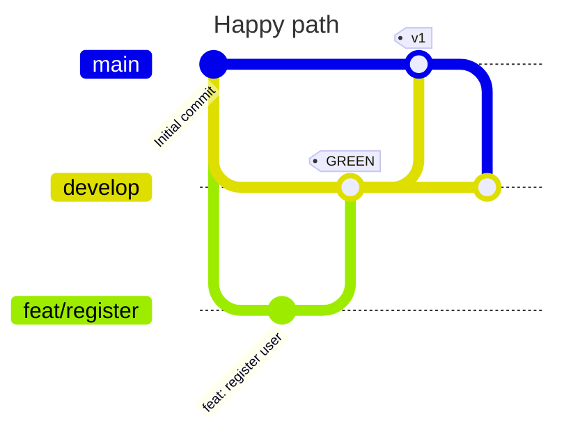

# Exercise 1: Implement and ship a working feature

By "implement a feature" we mean that you add a line to the end of the file
[workflows.txt](./workflows.txt). This will simulate the work required to add
a use case to the system.

1. Create and checkout the feature branch `feat/register` based on the `develop` branch: `git switch develop; git checkout -b feat/register`

2. Add the line `Register User: As a user I want to register, so that I can log in.` to the file [workflows.txt](./workflows.txt) and commit the changes with a speaking commit message: `git commit -am "feat: register user"`

3. Merge the feature branch into `develop`. Attention: Always create a merge commit, so that we could revert the merge easily. Use the `--no-ff` option. `git switch develop; git merge --no-ff feat/register`.

4. Refresh your web browser showing the simulation web app and compare the PROD system to the TEST system. TEST should show the added workflow while PROD is still empty.

5. Now let's assume that our integration tests were successful. Merge `develop` into `main`: `git switch main; git merge --no-ff develop`.

6. Refresh your web browser again. Now PROD and TEST should show the same workflows, but a different commit history - The final merge commit is missing on TEST.

7. Merge `main` back into `develop`: `git switch develop; git merge --no-ff main`.

8. Delete the feature branch: `git branch -d feat/register`

You have successfully added a feature :-)

---

- Next: [Exercise 2: Rollback and fix](./exercise-2-rollback-and-fix.md)
- Up: [Back to the exercises overview](./README.md)
