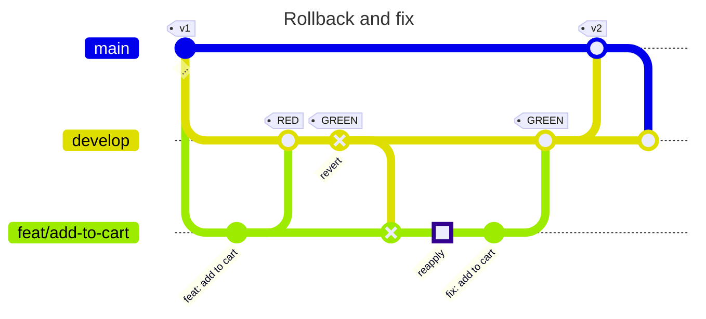

# Exercise 2: Implement a feature failing the tests in TEST, revert, fix, ship to PROD

In this exercise, we will add a new workflow with typo in the short description.

Using the row `-dd to Cart: As a user I want to add a product to the shopping cart, so that I can purchase it later.`, repeat steps 1-4 of exercise 1. Name your feature branch `feat/add-to-cart`.

4. The TEST system should show the workflow with the typo in the short description

5. Revert the merge commit on the `develop` branch to simulate that we free the test system for our peer developers:

   1. Inspect the merge commit to identify the ID of the parent you want to keep

   2. Copy the ID of the merge commit

   3. Revert the merge commit on develop: `git switch develop; git revert COMMITID -m X` on `develop` where X represents the commit ID of the head you want to keep. [(2)](../README.md#references) gives more details on this. Carefully inspect the commit message - it shows details about what has been reverted.

6. Verify that the TEST system does not show the new workflow. The commit history will show the merge commit and the revert commit

7. Switch to your feature branch: `git switch feat/add-to-cart`

8. Merge `develop` into your feature branch. Note that this will also remove your feature from your feature branch temporarily: `git merge --no-ff develop`

9. On your feature branch, revert the revert commit you have applied to `develop`. This "reapply" commit will bring the broken feature back:

   1. Get the ID of the revert commit on the `develop` branch

   2. Reapply the broken feature by reverting the revert commit: `git revert COMMITID`

   3. (relevant in exercise 3) If another team has shipped a feature in between, there will be merge conflicts. Fix these conflicts, but don't fix the broken feature yet. We want to keep reapply commit separate from the bug fix.

10. Fix the typo and commit it to the feature branch: `Add to Cart: As a user I want to add a product to the shopping cart, so that I can purchase it later.` - `git commit -am "fix: add to cart`

11. Merge the fixed feature to `develop`: `git switch develop; git merge --no-ff feat/add-to-cart`

12. Now the TEST system shows the corrected feature and the associated history

13. Finish shipping to PROD by following steps 5-7 of exercise 1.

---

- Previous: [Exercise 1: Implement and ship a working feature](./exercise-1-happy-path.md)
- Next: [Exercise 3: Concurrent feature development](./exercise-3-concurrent-development.md)
- Up: [Back to the exercises overview](./README.md)
