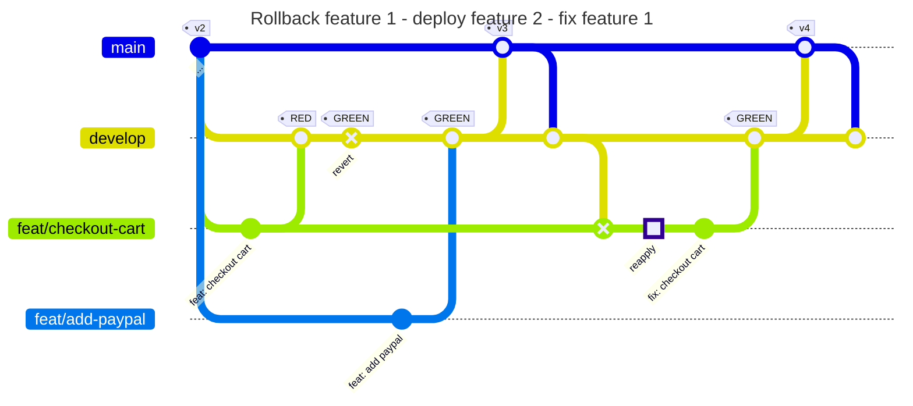

# Exercise 3: Concurrent feature development

In this exercise we will explicitly ship two concurrent features. The first feature is broken. We will revert the commit in TEST so that the second feature can be shipped before the fixed first feature is shipped.



First, create two feature branches from `develop`:

```shell
git branch feat/checkout-cart
git branch feat/add-paypal
```

Next, checkout the `feat/checkout-cart`. Then repeat steps 1-4 of exercise 1 using the workflow `-heckout Cart: As a user I want to checkout my shopping cart, so that my order gets shipped.`

Again, we want to free the TEST system for our peers. So execute steps 5 and 6 of exercise 2 to revert the merge to `develop`.

Before proceeding, we will simulate that another team develops a working feature in parallel: Switch to the branch `feat/add-paypal` and execute the full exercise 1 using the workflow `Add Paypal: As a customer I want to register my paypal account, so I can checkout my cart faster.`.

Note that the other team can ship their changes, because we reverted our broken feature on the `develop` branch.

Finally, fix the broken feature and ship it to PROD. Follow the steps 7 - end of exercise 2.

---

- Previous: [Exercise 2: Rollback and fix](./exercise-2-rollback-and-fix.md)
- Next: [Exercise 4: Protected branches](./exercise-4-protected-branches.md)
- Up: [Back to the exercises overview](./README.md)
