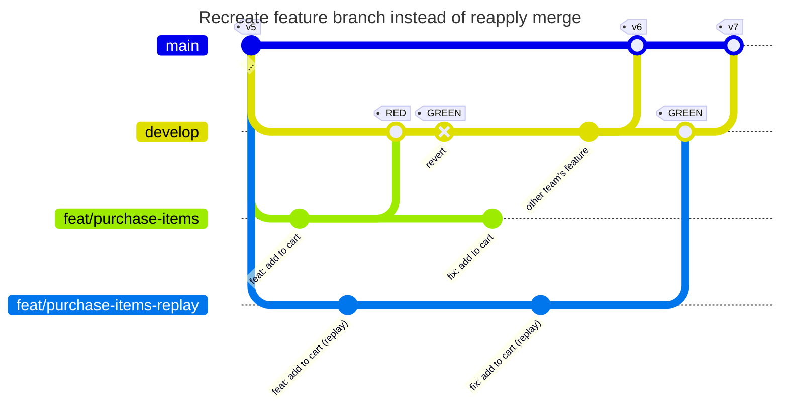

# Exercise 5: Recreate feature branch instead of reapply merge

The reapplied merge commit causes a headache when bisecting the git history in order to identify the commit which has introduced a problem [(3)](../README.md#references). A better solution is to replay the entire change set of the feature branch and avoid the reapply merge.

The following diagram presents an alternative to exercise 2, replacing the reapply merge with a replayed feature branch.

Using the row `-urchase Items: As a buyer I want to purchase ordered items, so that I ship them to the customer.`, repeat exercise 2. Name your feature branch `feat/purchase-items`.

Repeat exercise 2, but stop after step 6 and continue with the following steps:

7. Switch to `feat/purchase-items`, fix the typo and commit it to the feature branch.

8. Recreate the feature branch `feat/purchase-items`

   1. Find the ID of the base commit of the `feat/purchase-items` branch. This is the commit, where the feature branch was created from `develop`.

   2. Rebase the currently checked out feature branch onto the base commit: `git rebase --no-ff BASECOMMITID`

9. (optional) Merge `develop` into the feature branch to ensure that the feature branch is up-to-date with the latest changes in `develop`: `git merge --no-ff develop`

10. Ship the feature as described in steps 11 ff. of exercise 2.

---

- Previous: [Exercise 4: Protected branches](./exercise-4-protected-branches.md)
- Up: [Back to the exercises overview](./README.md)
